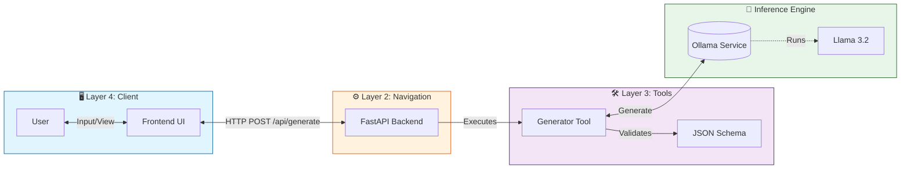

# 🚀 Local Test Case Generator (B.L.A.S.T. Protocol)

An agentic AI tool that generates comprehensive test cases from User Stories using a **Local LLM** (Llama 3.2) via Ollama. Built with privacy and determinism in mind, ensuring no data leaves your machine.

## 🏗️ Architecture

The system follows a strict 3-layer architecture to separate concerns and ensure reliability.



## ✨ Features

*   **🔒 Local & Private**: All processing happens on your machine using Ollama.
*   **⚡ Real-time UI**: Dark-themed, chat-like interface for easy interaction.
*   **📝 Structured Output**: Strictly formatted JSON test cases with Positive, Negative, and Edge case categorization.
*   **🛠️ Deterministic Tooling**: Python-based tool logic ensures consistent prompting and error handling.
*   **🌐 Single server**: One process serves the app and API — just open **http://localhost:3000**.

## 📋 Prerequisites

*   [Ollama](https://ollama.com/) installed and running.
*   Python 3.10+
*   **Model**: `llama3.2` pulled (`ollama pull llama3.2`).

## 🚀 Quick Start

### Option A: Use http://localhost:3000 without running anything each time (Windows)

1. **One-time setup:** Double-click **`install_autostart.bat`**.
2. The server is added to **Windows Startup** and starts in the background (no window). It also starts immediately so you can use the app right away.
3. From now on, whenever you log in, the server will be running. Just open **http://localhost:3000** in your browser anytime — no need to run `start.bat`.

To stop the server from starting at login later, run **`uninstall_autostart.bat`**. To stop the server right now: open Task Manager, find **python.exe** or **uvicorn**, and end the task.

### Option B: Start the server only when you need it

* **Windows:** Double-click **`start.bat`** (opens a terminal and your browser). Close the terminal to stop the server.
* **Linux / Mac:** Run **`./start_system.sh`**, then open **http://localhost:3000**.

Use the app at **http://localhost:3000** — enter a feature or scenario and get structured test cases.

## 📂 Project Structure

```
├── architecture/       # Layer 1: SOPs and Architecture definitions
├── backend/            # Layer 2: FastAPI app (serves API + frontend on :3000)
├── frontend/           # Layer 4: UI assets (HTML, CSS, JS)
├── tools/              # Layer 3: Deterministic Python Tools
├── install_autostart.bat   # (Windows) Run once — server starts at login, use localhost:3000 anytime
├── uninstall_autostart.bat # (Windows) Remove server from startup
├── run_server.vbs         # (Windows) Runs server in background (used by autostart)
├── start.bat              # Start server (Windows) — when you don't use autostart
├── start_system.sh        # Start server (Linux/Mac)
├── run_ollama.bat         # Optional: start Ollama
├── Blast.md            # Master System Prompt & Protocol
├── gemini.md           # Project Constitution (Data Schemas)
└── task_plan.md        # Execution Plan
```

## 🛡️ License

This project is part of the **AI Tester Blueprint** series.
